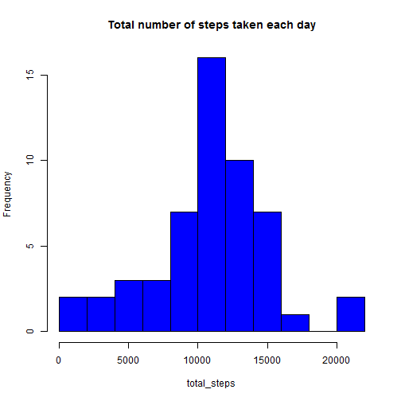
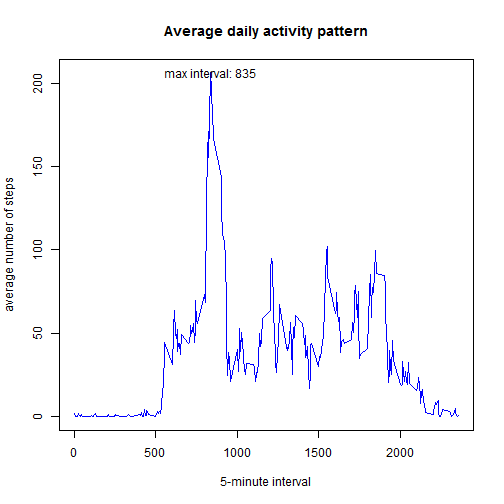
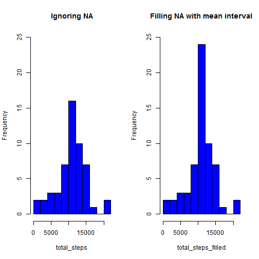

# Reproducible Research: Peer Assessment 1

## Loading and preprocessing the data  
#### assume the file name is "activity.csv" and locates in the working directory


```r
original_data <- read.csv("activity.csv",header = TRUE) 
omitna_data <- na.omit(original_data)   ## ignore the missing values 
```

## What is mean total number of steps taken per day?  
####  Ans. Median=10800 Mean=10800


```r
fc_date <- factor(omitna_data$date)
total_steps <- tapply(omitna_data$steps,fc_date,sum)
hist(total_steps, breaks=10,col="blue", main="Total number of steps taken each day")
```

 

```r
summary(total_steps)
```

```
##    Min. 1st Qu.  Median    Mean 3rd Qu.    Max. 
##      41    8840   10800   10800   13300   21200
```

```r
dev.copy(png, file = "fig1hist_totalnumber.png") 
```

```
## png 
##   3
```

```r
dev.off()
```

```
## pdf 
##   2
```

## What is the average daily activity pattern?
####  Ans. interval contains the maximum number of steps is 835 as shown in figure.


```r
fc_interval <- factor(omitna_data$interval)
interval<- as.integer(levels(fc_interval))  ## level of factor to show x-axis
avg_steps <- tapply(omitna_data$steps,fc_interval,mean) ## vector named by interval 
plot(interval,avg_steps,type="l",xlab="5-minute interval",ylab="average number of steps",main="Average daily activity pattern", col="blue")
## show interval location containing max steps in plot
text(interval[order(-avg_steps)[1]], avg_steps[order(-avg_steps)[1]], paste("max interval:",interval[order(-avg_steps)[1]])) 
```

 

```r
dev.copy(png, file = "fig2plot_dailyactivity.png") 
```

```
## png 
##   3
```

```r
dev.off()
```

```
## pdf 
##   2
```

## Imputing missing values
#### The total number of missing values in the dataset is 2304  
#### filling in all of the missing values in the dataset by mean value for that 5-minute interval instead of by mean for that day becuase all the data is NA during whole day in some cases  
#### Do these values differ from the estimates from the first part of the assignment? What is the impact of imputing missing data on the estimates of the total daily number of steps?  
#### Ans. The plot aligns to the center because missing value are filled by mean value. The difference of mean,median and 1st/3rd proofs this.
#### igonoring Median=10800 Mean=10800 (1st/3rd Qu=88400/13300)
#### filled Median=10800 Mean=10800 (1st/3rd Qu=9820/12800)

```r
## report total number of missing values in the dataset
nrow(original_data)-nrow(omitna_data)   
```

```
## [1] 2304
```

```r
## filling in all of the missing values in the dataset
filled_data <- original_data
for (i in 1:nrow(filled_data)){
    if(is.na(filled_data[i,"steps"])) {
        filled_data[i,"steps"] <- avg_steps[as.character(filled_data[i,"interval"]) ]
        }
}

## to show difference, create two plots

par(mfrow=c(1,2))

hist(total_steps, breaks=10,col="blue", main="Ignoring NA",ylim = c(0,25))

fc_date_filled <- factor(filled_data$date)
total_steps_filled <- tapply(filled_data$steps,fc_date_filled,sum)
hist(total_steps_filled, breaks=10,col="blue", main="Filling NA with mean interval",ylim = c(0,25))
```

 

```r
summary(total_steps)
```

```
##    Min. 1st Qu.  Median    Mean 3rd Qu.    Max. 
##      41    8840   10800   10800   13300   21200
```

```r
summary(total_steps_filled)
```

```
##    Min. 1st Qu.  Median    Mean 3rd Qu.    Max. 
##      41    9820   10800   10800   12800   21200
```

```r
dev.copy(png, file = "fig3plot_missing.png") 
```

```
## png 
##   3
```

```r
dev.off()
```

```
## pdf 
##   2
```

## Are there differences in activity patterns between weekdays and weekends?


```r
## independent of local time setting
Sys.setlocale("LC_TIME", "C")   
```

```
## [1] "C"
```

```r
## add weekday/weekend factor in filled_data
whatday <- weekdays(as.Date(filled_data[,"date"]))
for(i in 1:length(whatday)){
   if(whatday[i] =="Saturday" | whatday[i] == "Sunday"){ 
    whatday[i] <- " weekend"
     }else{
    whatday[i] <- " weekday"
	} 
}
whatday_data <- cbind(filled_data, whatday)

## create suitable dataframe for panel plot using weekend/weekday factor
whatday_data_we <- subset(whatday_data, whatday_data$whatday == " weekend")
fc_interval_we <- factor(whatday_data_we$interval)
avg_steps_we <- tapply(whatday_data_we$steps,fc_interval_we,mean)
we <- data.frame(interval=as.integer(levels(fc_interval_we)), steps=as.numeric(avg_steps_we),whatday = "weekend")

whatday_data_wd <- subset(whatday_data, whatday_data$whatday == " weekday")
fc_interval_wd <- factor(whatday_data_wd$interval)
avg_steps_wd <- tapply(whatday_data_wd$steps,fc_interval_wd,mean)
wd <- data.frame(interval=as.integer(levels(fc_interval_wd)), steps=as.numeric(avg_steps_wd),whatday = "weekday")

w <- rbind(wd,we)

## create weekend/weekday panel plot by weekend/weekday factor
library(lattice)
xyplot(w$steps ~ w$interval | w$whatday,layout=c(1,2), type="l",xlab="Interval",ylab="Number of steps")
```

 

```r
dev.copy(png, file = "fig4plot_whatday.png") 
```

```
## png 
##   3
```

```r
dev.off()
```

```
## pdf 
##   2
```

